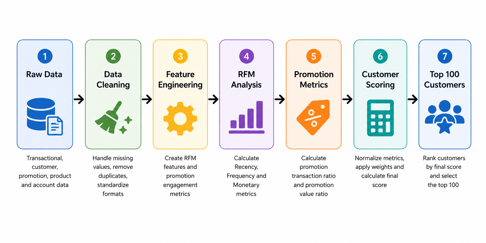

# CRM Promotion Targeting



## About

This project develops an interpretable CRM analytics framework to rank customers for a limited-time grocery promotion using transactional, customer, product, and promotion data.

The solution combines RFM analysis with promotion engagement metrics to build an interpretable customer scoring model for campaign targeting.

---

## Business Context

This project was completed as part of a CRM Analytics technical assessment.

The challenge was to identify 100 customers for a limited-time promotional campaign using five relational datasets without any additional documentation or data dictionary.


A grocery retailer plans a limited-time promotion but can target only 100 customers.

The objective is to identify customers who are most likely to deliver high business value based on historical purchasing behaviour and previous promotion engagement.

Rather than relying on a single metric, the project combines several behavioural indicators into a transparent customer ranking.

---

## Dataset

The analysis uses five datasets:

| Dataset   | Description                  |
| --------- | ---------------------------- |
| Customer  | Customer master data         |
| Sales     | Transaction history          |
| Promotion | Historical promotions        |
| Articles  | Product information          |
| Account   | Customer account information |

---

## Methodology

The analytical workflow consists of four stages:

### 1. Data Preparation

- data cleaning
- duplicate removal
- missing value handling
- feature engineering
- data validation

### 2. Customer Behaviour Analysis

Customer purchasing behaviour is evaluated using the RFM framework:

- Recency
- Frequency
- Monetary

### 3. Promotion Engagement

Two additional CRM metrics are calculated:

- Promotion Transaction Ratio
- Promotion Value Ratio

### 4. Customer Scoring

All metrics are normalized and combined into a weighted customer score.

Customers are ranked according to the final score, and the Top 100 customers are selected for the promotion campaign.

---

## Results

The project produces:

- customer RFM metrics
- promotion engagement metrics
- final customer score
- ranked Top 100 customer list

The final deliverable is a ranked list of the 100 highest-scoring customers for campaign execution:

```
outputs/
└── top_100_customers.csv
```

---

## Alternative Approaches Considered

Several alternative analytical approaches were considered.

**K-Means** and **Gaussian Mixture Models** could be used for customer segmentation. While valuable for long-term CRM strategy, they produce customer groups rather than a ranked list for a specific campaign.

**Linear Regression** and **XGBoost** could be applied to predict promotion response probabilities. However, supervised models require historical campaign response labels, which were not available in this case.

Given the business objective and available data, an interpretable scoring framework was selected as the most appropriate solution.

---

## Repository Structure

```
crm-promotion-targeting/
│
├── README.md
├── requirements.txt
├── .gitignore
│
├── notebooks/
│   └── local_grocery_100customers_limitedOffer.ipynb
│
├── outputs/
│   └── top_100_customers.csv
│
├── images/
│   ├── pipeline.png
│
└── data/
    ├── README.md
    └── .gitkeep
```

---

## Skills Demonstrated

- CRM Analytics
- Customer Analytics
- Marketing Analytics
- Customer Scoring
- Feature Engineering
- Data Cleaning
- Exploratory Data Analysis (EDA)
- RFM Analysis

## Business Value

The proposed scoring framework enables targeted campaign execution using transparent business rules.

Compared with selecting customers based on a single metric, the combined scoring approach incorporates purchasing behaviour and promotion engagement, resulting in a more balanced and explainable customer selection.

## Technologies

Python

Pandas

NumPy

Matplotlib

Jupyter Notebook
